# KEYBOARD por Naiara Zhiyao Lezameta Rodrigo DAM 1°

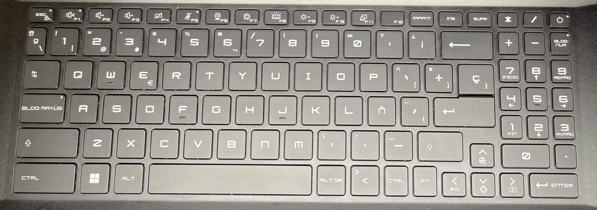

## Hilera 1

#### Tecla **ESC**
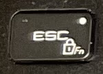
- **Función principal (ESC)**: La tecla ESC, abreviatura de "Escape", se usa generalmente para cancelar una operación o salir de un modo actual en muchas aplicaciones.
- **Función adicional (Candado y Fn)**: Este símbolo indica que puedes bloquear o desbloquear las funciones secundarias de las teclas de función (F1-F12). Al bloquear la tecla Fn, puedes usar las funciones especiales (como ajustar el volumen o el brillo) sin tener que presionar la tecla Fn cada vez.

#### Tecla **F1**
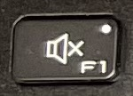
- **Función adicional (Altavoz con una "x")**: Esta función especial se usa para silenciar el sonido del sistema. Para activarla, generalmente presionarías "Fn + F1" a menos que la tecla Fn esté bloqueada (ver tecla ESC).

#### Tecla **F2**
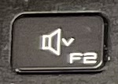
- **Función principal (F2)**: Comúnmente, F2 se usa para renombrar un archivo o carpeta seleccionada en muchos sistemas operativos.
- **Función adicional (Altavoz con flecha hacia abajo)**: Esta tecla se utiliza para bajar el volumen del sistema. Para activarla, presionarías "Fn + F2" a menos que la tecla Fn esté bloqueada.

#### Tecla **F3**
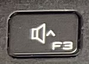
- **Función principal (F3)**: En muchas aplicaciones y navegadores, F3 se usa para buscar el siguiente resultado en una búsqueda.
- **Función adicional (Altavoz con flecha hacia arriba)**: Esta tecla se utiliza para subir el volumen del sistema. Para activarla, presionarías "Fn + F3" a menos que la tecla Fn esté bloqueada.

#### Tecla **F4**
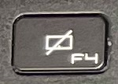
- **Función principal (F4)**: En muchas aplicaciones, presionar F4 junto con la tecla Alt (Alt + F4) cierra la ventana activa.
- **Función adicional (Pantalla con una línea diagonal)**: Este símbolo indica que la tecla se utiliza para desactivar la pantalla o poner la computadora en modo de suspensión. Para activar esta función, generalmente presionarías "Fn + F4".

#### Tecla **F5**
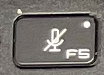
- **Función principal (F5)**: En muchos navegadores y aplicaciones, F5 se usa para actualizar la página o el contenido.
- **Función adicional (Micrófono con una línea diagonal)**: Esta tecla se utiliza para silenciar el micrófono. Para activar esta función, presionarías "Fn + F5".

#### Tecla **F6**
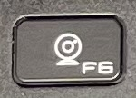
- **Función principal (F6)**: En algunos navegadores, F6 se utiliza para mover el cursor a la barra de direcciones.
- **Función adicional (Cámara web)**: Esta tecla se utiliza para encender o apagar la cámara web. Para activar esta función, presionarías "Fn + F6".

#### Tecla **F7**
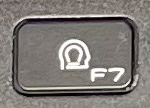
- **Función principal (F7)**: En muchas aplicaciones de procesamiento de texto, F7 se utiliza para iniciar una revisión ortográfica y gramatical.
- **Función adicional (Icono de privacidad)**: Esta tecla puede estar asociada con una función de privacidad, como desactivar la cámara web o el micrófono para asegurar la privacidad. Para activar esta función, presionarías "Fn + F7".

#### Tecla **F8**
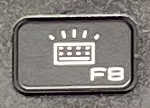
- **Función principal (F8)**: En algunas aplicaciones, F8 se utiliza para acceder a las opciones de inicio avanzadas, especialmente en sistemas operativos más antiguos.
- **Función adicional (Teclado con luz)**: Esta tecla se utiliza para activar o desactivar la retroiluminación del teclado. Para activar esta función, presionarías "Fn + F8".

#### Tecla **F9**
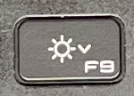
- **Función principal (F9)**: En algunas aplicaciones, F9 puede ser utilizada para actualizar o recargar datos.
- **Función adicional (Sol con flecha hacia abajo)**: Esta tecla se utiliza para disminuir el brillo de la pantalla. Para activar esta función, presionarías "Fn + F9".

#### Tecla **10**
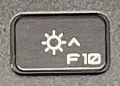
- **Función principal (F10)**: En muchos programas, F10 activa la barra de menús.
- **Función adicional (Sol con flecha hacia arriba)**: Esta tecla se utiliza para aumentar el brillo de la pantalla. Para activar esta función, presionarías "Fn + F10".

#### Tecla **F11**

- **Función principal (F11)**: En la mayoría de los navegadores, F11 activa y desactiva el modo de pantalla completa.
- **Función adicional (Dos pantallas superpuestas)**: Esta tecla se utiliza para alternar entre los modos de pantalla o proyectar la pantalla en un monitor externo. Para activar esta función, presionarías "Fn + F11".

#### Tecla **F12**
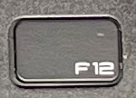
- **Función principal (F12)**: En muchos navegadores, presionar F12 abre las herramientas de desarrollo o la consola de desarrollador.
- **Función adicional (no tiene un símbolo adicional en esta imagen)**: Esta tecla no parece tener una función adicional visible.

#### Tecla **IMPRINT**
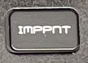
- **Función principal (IMPRINT)**: Esta tecla se utiliza para capturar una captura de pantalla de toda la pantalla y guardarla en el portapapeles. En algunos sistemas, puede estar etiquetada como "Print Screen" o "PrtScn".

#### Tecla **INS**
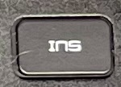
- **Función principal (Ins)**: La tecla Ins (Insertar) se utiliza para alternar entre los modos de inserción y sobrescritura mientras se escribe. En el modo de inserción, el texto que escribes se inserta en la posición del cursor. En el modo de sobrescritura, el texto que escribes reemplaza el texto existente.

#### Tecla **SUPR**
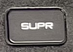
- **Función principal (Supr)**: La tecla Supr (Suprimir o Delete) se utiliza para eliminar el carácter en la posición del cursor o para eliminar el texto o elementos seleccionados.

#### Tecla **\***
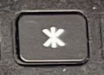
- **Función principal**: La tecla con el símbolo de asterisco (*) se encuentra generalmente en la parte del teclado numérico. Se utiliza para realizar la operación de multiplicación en cálculos matemáticos.

#### Tecla **/**
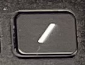
- **Función principal**: La tecla con el símbolo de barra diagonal (/) también se encuentra en la parte del teclado numérico. Se utiliza para realizar la operación de división en cálculos matemáticos.
- **Función adicional (Shift + /)**: Cuando se usa con la tecla Shift, esta tecla genera el signo de interrogación (?). En muchos teclados, esta tecla también puede estar ubicada cerca de la tecla Shift.

#### Tecla **Apagar**
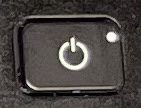
- **Función principal**: La tecla con el símbolo de encendido/apagado se utiliza para encender o apagar el dispositivo. Dependiendo de la configuración del sistema operativo, puede:
  - **Encender el dispositivo**: Si el dispositivo está apagado.
  - **Poner el dispositivo en modo de suspensión o hibernación**: Si el dispositivo está encendido y la tecla se presiona brevemente.
  - **Apagar el dispositivo**: Si se mantiene presionada durante varios segundos, generalmente forzando el apagado.

## Hilera 2
#### Tecla con los símbolos ordinal femenino (ª), ordinal masculino (º) y barra invertida (\)
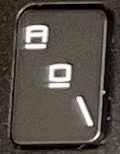
- **Función principal**: Esta tecla tiene múltiples funciones dependiendo del contexto:
  - **ª**: Símbolo de ordinal femenino (como en "1ª" para "primera").
  - **º**: Símbolo de ordinal masculino (como en "1º" para "primero").
  - **\**: Barra invertida, utilizada en rutas de archivos en sistemas Windows y para escape de caracteres en muchos lenguajes de programación.

#### Tecla **!** **1** **|**

#### Tecla con los símbolos de exclamación (!), número 1 (1) y barra vertical (|)
- **Función principal**: Esta tecla tiene múltiples funciones dependiendo del contexto:
  - **!**: Símbolo de exclamación, usado para enfatizar y en programación.
  - **1**: Número 1, utilizado en cálculos y numeración.
  - **|**: Barra vertical, utilizada en programación y para comandos en línea de comandos.

#### Tecla **2** **@**
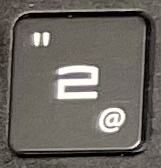
- **Función principal**: Esta tecla tiene el número 2 como su función principal.
- **Función adicional (Shift + 2)**: Cuando se usa con la tecla Shift, genera el símbolo arroba (@).

#### Tecla **.** **3** **#**
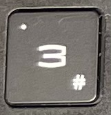
- **Función principal**: Esta tecla tiene múltiples funciones dependiendo del contexto:
  - **3**: Número 3, utilizado en cálculos y numeración.
  - **.**: Punto, utilizado en escritura y programación.
  - **#**: Símbolo de almohadilla, utilizado en programación, redes sociales, y otros contextos.

#### Tecla **4** **$**
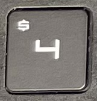
- **Función adicional (Shift + 4)**: Cuando se usa con la tecla Shift, genera el símbolo de dólar ($).
- **Función principal**: Esta tecla tiene el número 4 como su función principal.
- 
#### Tecla **5** **%**
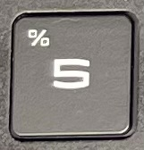
- **Función principal**: 
  - **5**: Número 5, utilizado en cálculos y numeración.
- **Función adicional (Shift + 5)**: 
  - **%**: Símbolo de porcentaje, utilizado en matemáticas y estadística.

#### Tecla  **&** **6** **𠃍**

- **Función principal**: 
  - **6**: Número 6, utilizado en cálculos y numeración.
- **Función adicional (Shift + 6)**: 
  - **&**: Símbolo de ampersand, utilizado en programación y escritura.
- **Símbolo adicional**: 
  - **𠃍**: Símbolo de ángulo recto, utilizado en algunos contextos específicos y en ciertos lenguajes de programación.

#### Tecla **7** **/**
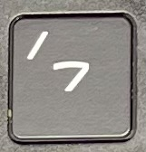
- **Función principal**: 
  - **7**: Número 7, utilizado en cálculos y numeración.
- **Función adicional (Shift + 7)**: 
  - **/**: Barra inclinada, utilizada en fracciones, direcciones URL, y comandos en línea de comandos.

#### Tecla **8** **(**
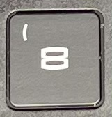
- **Función principal**: 
  - **8**: Número 8, utilizado en cálculos y numeración.
- **Función adicional (Shift + 8)**: 
  - **(**: Paréntesis de apertura, utilizado en matemáticas, programación y escritura.

#### Tecla con el número 9 y el símbolo de paréntesis de apertura (()
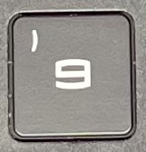
- **Función principal**: 
  - **9**: Número 9, utilizado en cálculos y numeración.
- **Función adicional (Shift + 9)**: 
  - **)**: Paréntesis de cierre, utilizado en matemáticas, programación y escritura.

#### Tecla **=** **+**
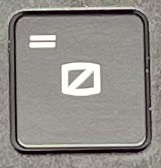
- **Función principal**: Esta tecla tiene el símbolo de igualdad (=) como su función principal.
- **Función adicional (Shift + =)**: Cuando se usa con la tecla Shift, genera el símbolo de más (+).

#### Tecla **?** **'**
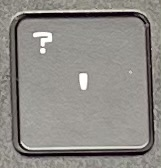
- **Función principal**: 
  - **'**: Apóstrofo, utilizado en escritura y programación.
- **Función adicional (Shift + ')**: 
  - **?**: Signo de interrogación, utilizado en preguntas y en programación.
  - 
#### Tecla **¿** **¡**
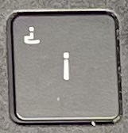
- **Función principal**: 
  - **¡**: Símbolo de exclamación invertida, utilizado en el inicio de exclamaciones en español.
- **Función adicional (Shift + ¡)**: 
  - **¿**: Símbolo de interrogación invertida, utilizado en el inicio de preguntas en español.

#### Tecla **<—**
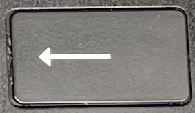
- **Función principal**: Esta tecla se utiliza para borrar el carácter a la izquierda del cursor o para retroceder al navegar.

#### Tecla **+**
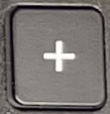
- **Función principal**: Esta tecla tiene el símbolo de más (+) como su función principal, comúnmente utilizada en el teclado numérico para operaciones matemáticas de suma.

#### Tecla **-**
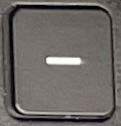
- **Función principal**: Esta tecla tiene el símbolo de menos (-) como su función principal, comúnmente utilizada en el teclado numérico para operaciones matemáticas de resta.

#### Tecla **Bloq Num**
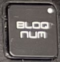
- **Función principal**: La tecla Bloq Num (Bloqueo Numérico) se utiliza para activar o desactivar el teclado numérico. Cuando está activada, las teclas del teclado numérico introducen números; cuando está desactivada, las mismas teclas pueden funcionar como teclas de navegación (como las flechas).
## Hilera 3
#### Tecla **⇤ ⇥**
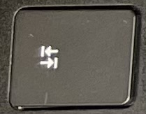
- **Función principal**: Esta tecla generalmente se utiliza para cambiar la orientación o el idioma del texto en algunos programas. También puede funcionar como una tecla de tabulación o para mover el cursor en ciertos contextos.

#### Tecla **Q**
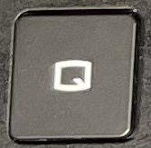
- **Función principal**: Esta tecla generalmente se utiliza para abrir el menú de aplicaciones o el menú de inicio en algunos sistemas operativos. También puede funcionar como una tecla de acceso rápido para ciertas funciones del sistema.

#### Tecla **W**
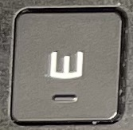
- **Función principal**: Esta tecla puede tener diferentes funciones dependiendo del contexto del software o sistema operativo. Comúnmente se utiliza para minimizar ventanas o abrir la barra de tareas.
#### Tecla **E** **€**
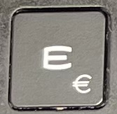
- **Función principal**: Esta tecla tiene la letra E como su función principal.
- **Función adicional (Alt Gr + E)**: Genera el símbolo del euro (€), utilizado como la moneda de la Unión Europea.

#### Tecla **R**
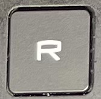
- **Función principal**: Esta tecla tiene la letra R como su función principal.

#### Tecla **T**
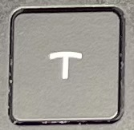
- **Función principal**: Esta tecla tiene la letra T como su función principal.

#### Tecla **Y**
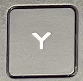
- **Función principal**: Esta tecla tiene la letra Y como su función principal.
#### Tecla **U**
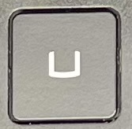
- **Función principal**: Esta tecla tiene la letra U como su función principal.

#### Tecla **I**
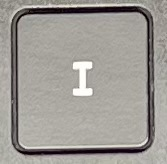
- **Función principal**: Esta tecla tiene la letra I como su función principal.

#### Tecla **O**
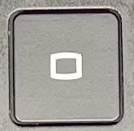
- **Función principal**: Esta tecla tiene la letra O como su función principal.

#### Tecla **P**
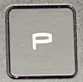
- **Función principal**: Esta tecla tiene la letra P como su función principal.
#### Tecla **^** **-** **[**
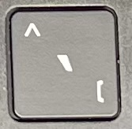
- **Función principal**: 
  - **-**: Guion medio, utilizado en escritura y programación.
- **Función adicional (Shift + -)**:
  - **^**: Acento circunflejo, utilizado en algunos idiomas y en programación.
- **Función adicional (Alt Gr + -)**:
  - **[**: Corchete de apertura, utilizado en programación y matemáticas.
#### Tecla **\*** **+** **]**
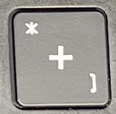
- **Función principal**: 
  - **+**: Símbolo de suma, utilizado en matemáticas y programación.
- **Función adicional (Shift + +)**:
  - **\***: Asterisco, utilizado en escritura y programación.
- **Función adicional (Alt Gr + +)**:
  - **]**: Corchete de cierre, utilizado en programación y matemáticas.

#### Tecla **Ç** **}**
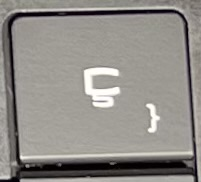
- **Función principal**: 
  - **Ç**: Letra Ç, utilizada en algunos idiomas como el portugués y el francés.
- **Función adicional (Alt Gr + Ç)**:
  - **}**: Llave de cierre, utilizada en programación y matemáticas.

#### Tecla **7** **Inicio**
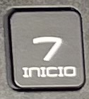
- **Función principal**: 
  - **7**: Número 7, utilizado en cálculos y numeración.
- **Función adicional (Num Lock desactivado)**:
  - **Inicio**: Mueve el cursor al principio de la línea de texto.

#### Tecla **8** **↑**
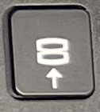
- **Función principal**: 
  - **8**: Número 8, utilizado en cálculos y numeración.
- **Función adicional (Num Lock desactivado)**:
  - **↑**: Flecha hacia arriba, utilizada para mover el cursor hacia arriba en el texto.

#### Tecla **9** **REPAG**

- **Función principal**: 
  - **9**: Número 9, utilizado en cálculos y numeración.
- **Función adicional (Num Lock desactivado)**:
  - **Re Pág**: Desplaza una página hacia arriba en un documento o una ventana.
### Hilera 4
#### Tecla **Bloq Mayús**

- **Función principal**: La tecla Bloq Mayús (Bloqueo de Mayúsculas) se utiliza para activar o desactivar el uso continuo de letras mayúsculas. Cuando está activada, todas las letras se escriben en mayúsculas sin necesidad de mantener presionada la tecla Shift.

#### Tecla **A**

- **Función principal**: Esta tecla tiene la letra A como su función principal.

#### Tecla **S**

- **Función principal**: Esta tecla tiene la letra S como su función principal.

#### Tecla **D**

- **Función principal**: Esta tecla tiene la letra D como su función principal.

#### Tecla **F**

- **Función Primaria**: Introduce la letra minúscula `f` o la mayúscula `F` cuando se combina con la tecla `Shift`.
- **Teclas de Combinación**:
  - `Ctrl + F`: Abre la función de búsqueda en la mayoría de los navegadores y aplicaciones de texto.
  - `Alt + F4`: Cierra la ventana activa en Windows.
  - `Shift + F10`: Abre el menú contextual (equivalente a hacer clic derecho).
  - **Teclas de Marcado**: Las teclas `F` y `J` a menudo tienen pequeñas marcas táctiles para ayudar a los usuarios a posicionar sus dedos correctamente sin mirar el teclado.
  - **Uso en Programación**: Estas teclas también pueden ser utilizadas en varios atajos de teclado específicos de IDEs (entornos de desarrollo integrado) y editores de código para navegar, editar y gestionar código de manera más eficiente.
#### Tecla **G**

- **Función Primaria**: Introduce la letra minúscula `g` o la mayúscula `G` cuando se combina con la tecla `Shift`.
- **Teclas de Combinación**:
  - `Ctrl + G`: Abre el cuadro de diálogo "Ir a" en algunos editores de texto como Notepad++ y Visual Studio Code.
  - `Ctrl + Shift + G`: En algunos navegadores y editores, busca la siguiente aparición de la búsqueda actual.

#### Tecla **H**

- **Función Primaria**: Introduce la letra minúscula `h` o la mayúscula `H` cuando se combina con la tecla `Shift`.
- **Teclas de Combinación**:
  - `Ctrl + H`: Abre la función de reemplazo en muchos editores de texto y aplicaciones.
  - `Alt + H`: Abre la pestaña de ayuda en algunas aplicaciones, especialmente en Microsoft Office.

#### Tecla **J**

- **Función Primaria**: Introduce la letra minúscula `j` o la mayúscula `J` cuando se combina con la tecla `Shift`.
- **Teclas de Combinación**:
  - `Ctrl + J`: Abre la ventana de descargas en algunos navegadores como Google Chrome.
  - `Shift + J`: En algunos entornos de desarrollo, puede moverse a la siguiente línea o elemento, dependiendo de la configuración del editor.
  - **Teclas de Marcado**: Las teclas `F` y `J` a menudo tienen pequeñas marcas táctiles para ayudar a los usuarios a posicionar sus dedos correctamente sin mirar el teclado.
  - **Uso en Programación**: Estas teclas también pueden ser utilizadas en varios atajos de teclado específicos de IDEs (entornos de desarrollo integrado) y editores de código para navegar, editar y gestionar código de manera más eficiente.

#### Tecla **K**

- **Función Primaria**: Introduce la letra minúscula `k` o la mayúscula `K` cuando se combina con la tecla `Shift`.
- **Teclas de Combinación**:
  - `Ctrl + K`: En muchos editores de texto y navegadores, abre la opción de insertar un enlace.
  - `Ctrl + Shift + K`: En algunos editores de texto, corta la línea actual.
  - `Alt + K`: Puede tener funciones específicas dependiendo del programa.

#### Tecla **L**

- **Función Primaria**: Introduce la letra minúscula `l` o la mayúscula `L` cuando se combina con la tecla `Shift`.
- **Teclas de Combinación**:
  - `Ctrl + L`: Selecciona la barra de direcciones en la mayoría de los navegadores.
  - `Ctrl + Shift + L`: En algunos editores de texto, selecciona todas las ocurrencias de la palabra seleccionada.
  - `Alt + L`: Puede tener funciones específicas dependiendo del programa.

#### Tecla **Ñ**

- **Función Primaria**: Introduce la letra minúscula `ñ` o la mayúscula `Ñ` cuando se combina con la tecla `Shift`.
- **Teclas de Combinación**:
  - En la mayoría de los casos, la `Ñ` no tiene combinaciones específicas, pero se usa en la escritura de palabras en español.
  
### Tecla **¨** **'** **{**

- **Función Primaria**: Introduce la diéresis `¨` cuando se presiona sin combinación.
- **Función Secundaria**: Introduce la llave `{` cuando se combina con la tecla `Shift`.
- **Teclas de Combinación**:
  - `'` (Apóstrofo): Usado para delimitar caracteres en muchos lenguajes de programación (por ejemplo, `'a'` en Python o C).
  - `{` (Llave): Usada para delimitar bloques de código en muchos lenguajes de programación como Java, C, y JavaScript.

#### Tecla **Enter**

**Funciones**
- Confirmar comandos: Ejecuta comandos o confirma selecciones.
- Salto de línea: Crea un nuevo párrafo en procesadores de texto.
- Enviar mensajes: Envía mensajes o datos en formularios en línea.

#### Tecla **4** **<-**

**Funciones del número 4**
1. **Ingresar el número 4**: 
   - **Descripción**: Inserta el dígito "4" en cualquier campo de texto.
   - **Ejemplo**: Al escribir en un documento o en una calculadora, presionar esta tecla añade el número 4.

2. **Acceder a caracteres secundarios**: 
   - **Descripción**: En algunos teclados, al combinarse con otras teclas (como Shift), puede insertar caracteres especiales.
   - **Ejemplo**: En algunos teclados, presionar Shift + 4 inserta el símbolo "$".

3. **Función específica en aplicaciones**: 
   - **Descripción**: En ciertas aplicaciones o videojuegos, puede tener una función asignada específica.
   - **Ejemplo**: En un juego, la tecla 4 podría utilizarse para seleccionar una herramienta o arma específica.

**Funciones de la tecla ← (Backspace)**
1. **Borrar caracteres**: 
   - **Descripción**: Elimina el carácter situado inmediatamente antes del cursor en un campo de texto.
   - **Ejemplo**: Al escribir en un documento o en un campo de texto, presionar esta tecla elimina el último carácter ingresado.

2. **Eliminar selección**: 
   - **Descripción**: Si hay texto seleccionado, esta tecla borra todo el texto seleccionado.
   - **Ejemplo**: Al seleccionar una palabra o una frase y presionar Backspace, todo el texto seleccionado será eliminado.

3. **Navegar en formularios**: 
   - **Descripción**: En algunos navegadores y aplicaciones, puede utilizarse para retroceder a la página anterior o para salir de un campo de texto.
   - **Ejemplo**: En un formulario en línea, si el campo actual está vacío, presionar esta tecla puede mover el foco al campo anterior.

#### Tecla **5**

**Funciones**
- Escribir número 5: Se utiliza para escribir el número "5".
- Escribir guion bajo (_): Con la tecla Shift presionada, se escribe el símbolo de guion bajo (_).

#### Tecla **6**

**Funciones**
- Escribir número 6: Se utiliza para escribir el número "6".
- Escribir flecha (→): Con la tecla Shift presionada, se escribe el símbolo de flecha (→).
## Hilera 5
#### Tecla **Shift**

**Funciones**
- Letras mayúsculas: Se utiliza para escribir letras mayúsculas.
- Símbolos superiores: Permite escribir los símbolos superiores de las teclas que tienen dos caracteres.
#### Tecla **Z**

**Funciones**
- Escribir letra z: Se utiliza para escribir la letra "z".
- Atajo común: Usada en combinación con otras teclas para deshacer (Ctrl + Z) en muchas aplicaciones.

#### Tecla **X**

**Funciones**
- Escribir letra x: Se utiliza para escribir la letra "x".
- Atajo común: Usada en combinación con otras teclas para cortar (Ctrl + X) en muchas aplicaciones.

#### Tecla **C**

**Funciones**
- Escribir letra c: Se utiliza para escribir la letra "c".
- Atajo común: Usada en combinación con otras teclas para copiar (Ctrl + C) en muchas aplicaciones.

#### Tecla **V**

**Funciones**
- Escribir letra v: Se utiliza para escribir la letra "v".
- Atajo común: Usada en combinación con otras teclas para pegar (Ctrl + V) en muchas aplicaciones.
#### Tecla **B**

**Funciones**
- Escribir letra b: Se utiliza para escribir la letra "b".

#### Tecla **N**

**Funciones**
- Escribir letra n: Se utiliza para escribir la letra "n".

#### Tecla **M**

**Funciones**
- Escribir letra m: Se utiliza para escribir la letra "m".

#### Tecla **;** **,**

- **Funciones:**
  - El punto y coma (;) se utiliza para finalizar declaraciones en lenguajes como JavaScript, Java y C++.
  - Los dos puntos (:) se utilizan en diversas situaciones, como definir bloques en Python y en operadores ternarios.

#### Tecla **.** **>**

- **Funciones:**
  - El punto (.) se utiliza para acceder a propiedades y métodos de objetos en muchos lenguajes de programación como JavaScript y Python.
  - El símbolo mayor que (>) se usa en comparaciones y para redirección de salida en la línea de comandos.

#### Tecla **-** **_**

- **Funciones:**
  - El guión (-) se usa para restar números y en nombres de variables.
  - El guión bajo (_) se usa en nombres de variables, especialmente en lenguajes que no permiten espacios en los nombres de las variables.

#### Tecla **Shift**

- **Funciones:**
  - La tecla Shift se usa para escribir letras mayúsculas y para acceder a los caracteres superiores en teclas con dos símbolos.
# Uso de Teclas en Programación

A continuación se describen algunas teclas comunes y su uso en programación:

#### Tecla **;** **,**

- **Funciones:**
  - El punto y coma (;) se utiliza para finalizar declaraciones en lenguajes como JavaScript, Java y C++.
  - Los dos puntos (:) se utilizan en diversas situaciones, como definir bloques en Python y en operadores ternarios.

#### Tecla **^ (Circunflejo)** **Ventilador**

- **Funciones de ^:**
  - La tecla de circunflejo se usa para escribir el símbolo ^.
  - Puede ser usada en combinación con otras teclas para crear caracteres acentuados en algunos idiomas.
  - En algunos teclados, esta tecla puede tener funciones adicionales en combinación con teclas modificadoras (Ctrl, Alt).

- **Funciones de ventilador:**
  - **Refrigeración**: Mantiene frescos los componentes del equipo.
  - **Ventilación**: Asegura la circulación del aire dentro del gabinete.
  - **Prevención de sobrecalentamiento**: Ayuda a evitar que el sistema se sobrecaliente y se dañe.

#### Tecla **.**

- **Funciones:**
  - La tecla de punto (.) se usa en muchos contextos, como en números decimales y al acceder a propiedades y métodos de objetos en programación.
## Hilera 6
#### Tecla **Ctrl**

- **Funciones:**
  - La tecla Control (Ctrl) se usa en combinación con otras teclas para ejecutar comandos específicos:
    - **Ctrl+C**: Copiar.
    - **Ctrl+V**: Pegar.
    - **Ctrl+X**: Cortar.
    - **Ctrl+Z**: Deshacer.
    - **Ctrl+Y**: Rehacer.
    - **Ctrl+A**: Seleccionar todo.
    - **Ctrl+S**: Guardar.
    - **Ctrl+P**: Imprimir.
    - **Ctrl+F**: Buscar.
    - **Ctrl+N**: Nuevo documento o ventana.
    - **Ctrl+T**: Nueva pestaña en navegadores.
    - **Ctrl+W**: Cerrar ventana o pestaña.
    - **Ctrl+Tab**: Navegar entre pestañas.
    - **Ctrl+Esc**: Abrir el menú de inicio en Windows.
    - **Ctrl+Alt+Delete**: Abrir el administrador de tareas en Windows.
    - **Ctrl+Shift+Esc**: Abrir el administrador de tareas directamente en Windows.
    - **Ctrl+Home**: Ir al principio del documento.
    - **Ctrl+End**: Ir al final del documento.
#### Tecla **Windows**

- **Funciones:**
  - Abrir el menú de inicio en Windows.
  - **Windows + E**: Abrir el explorador de archivos.
  - **Windows + D**: Mostrar o ocultar el escritorio.
  - **Windows + L**: Bloquear el equipo.
  - **Windows + R**: Abrir el cuadro de diálogo "Ejecutar".
  - **Windows + I**: Abrir la configuración.
  - **Windows + Tab**: Vista de tareas.
  - **Windows + Pausa**: Abrir el cuadro de propiedades del sistema.

#### Tecla **Alt**

- **Funciones:**
  - Se usa en combinación con otras teclas para ejecutar comandos.
  - **Alt + Tab**: Cambiar entre aplicaciones abiertas.
  - **Alt + F4**: Cerrar la ventana activa.
  - **Alt + Espacio**: Abrir el menú del sistema de la ventana activa.
  - **Alt + Enter**: Mostrar las propiedades del archivo seleccionado.

#### Tecla **Espacio**

- **Funciones:**
  - Inserta un espacio en el texto.
  - Se usa en combinación con otras teclas para realizar funciones específicas en algunos programas.

#### Tecla **AltGr**

- **Funciones:**
  - Se usa para acceder a los caracteres alternativos de algunas teclas.
  - **Alt Gr + 2**: Escribir el símbolo @ en muchos teclados.
  - **Alt Gr + E**: Escribir el símbolo € en muchos teclados.
  - Puede ser usada para caracteres especiales dependiendo de la configuración del teclado.
#### Tecla **Fn**

- **Funciones:**
  - La tecla Fn (Función) se utiliza en combinación con otras teclas para acceder a funciones adicionales que no tienen teclas dedicadas. 
  - Comúnmente usada en teclados de laptops para controlar el brillo de la pantalla, volumen, y otras funciones del sistema.

#### Tecla **⏮️** **⏯️**

- **Funciones:**
  - Esta tecla se utiliza para controlar la reproducción de medios.
  - **Retroceder (⏮️)**: Vuelve al inicio de la pista anterior o actual.
  - **Reproducir/Pausar (⏯️)**: Inicia o pausa la reproducción de un archivo de medios.

#### Tecla **🔽** **🎯**

- **Funciones:**
  - **Flecha Abajo (🔽)**: Mueve el cursor o el foco hacia abajo en el sistema operativo o aplicaciones.
  - **Mira (🎯)**: Activa o desactiva una función de enfoque o mira en algunas aplicaciones o juegos. Puede necesitar la combinación con la tecla Fn en algunos teclados de laptops.

#### Tecla **▶️** **🔒**

- **Funciones:**
  - **Flecha Derecha (➡️)**: Mueve el cursor o el foco hacia la derecha en el sistema operativo o aplicaciones.
  - **Bloquear (🔒)**: Activa o desactiva la función de bloqueo del sistema o de ciertos elementos específicos. Puede necesitar la combinación con la tecla Fn en algunos teclados de laptops.